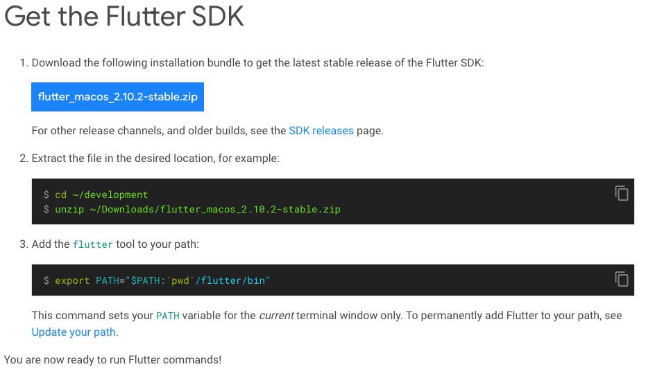

# 설치
## Flutter SDK 다운 
> flutter install search

### 압축 풀기
> unzip /Users/kimmoonkyung/devtools/flutter_macos_2.10.2-stable.zip

### 환경변수 등록
```
    open ~/.zshrc or touch ~/.zshrc
        export PATH="$PATH:플러터설치경로/bin"
            저장
        이후 터미널에서 flutter doctor
            - m1 맥은 에러 발생 할 수 있음.
            - 터미널 종료, 재부팅 후 터미널에 softwareupdate --instal -rosetta 입력
```


> 

## android studio 설치
> https://developer.android.com/studio?gclid=CjwKCAiAvOeQBhBkEiwAxutUVJl6udJqFzMwngO-SO5XYUrM77_C9wM_ql0IB36PLIqKvlf8PMW2OhoCP8EQAvD_BwE&gclsrc=aw.ds#downloads

### android studio에 Flutter 설치
> plugins > flutter search

### sdk mangaer 설치
> Projects > More Actions > SDK Manager > Sdk Tools > Android SDK Command-line Tools checked