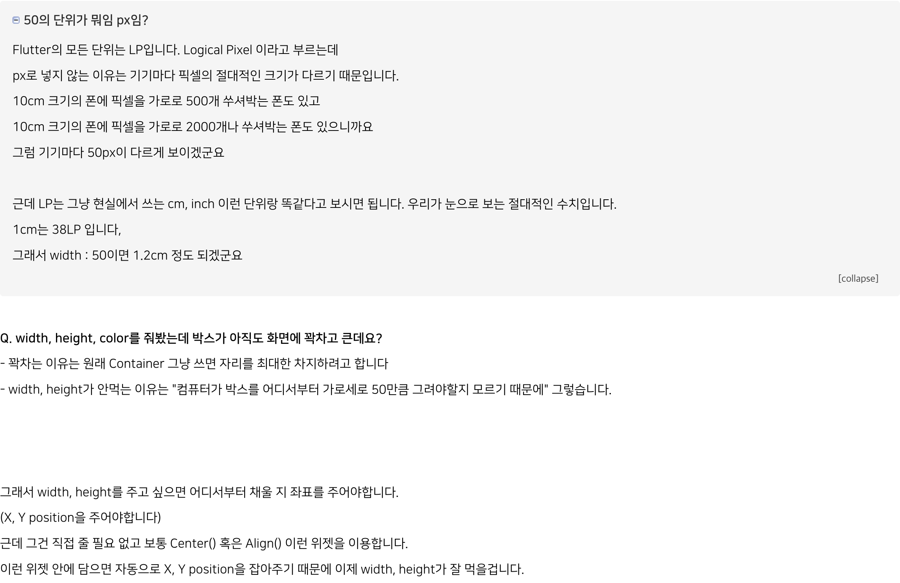
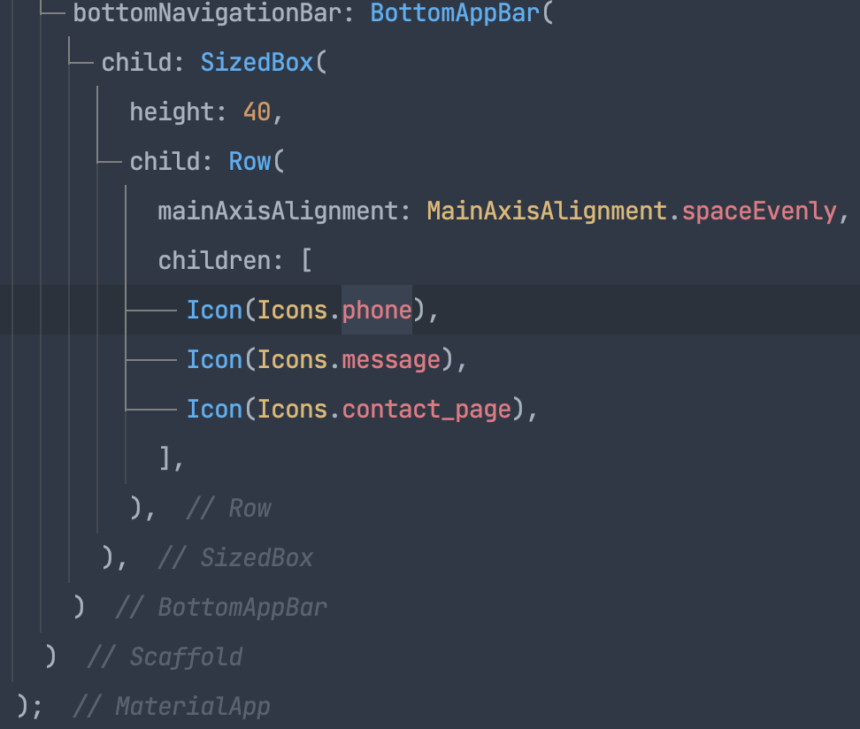

# 설치
## Flutter SDK 다운 
> flutter install search

### 압축 풀기
> unzip /Users/kimmoonkyung/devtools/flutter_macos_2.10.2-stable.zip

### 환경변수 등록
```
    open ~/.zshrc or touch ~/.zshrc
        export PATH="$PATH:플러터설치경로/bin"
            저장
        이후 터미널에서 flutter doctor
            - m1 맥은 에러 발생 할 수 있음.
            - 터미널 종료, 재부팅 후 터미널에 softwareupdate --instal -rosetta 입력
```


> 

## android studio 설치
> https://developer.android.com/studio?gclid=CjwKCAiAvOeQBhBkEiwAxutUVJl6udJqFzMwngO-SO5XYUrM77_C9wM_ql0IB36PLIqKvlf8PMW2OhoCP8EQAvD_BwE&gclsrc=aw.ds#downloads

### android studio에 Flutter 설치
> plugins > flutter search

### sdk mangaer 설치
> Projects > More Actions > SDK Manager > Sdk Tools > Android SDK Command-line Tools checked

### Android license status unknown
> 터미널 - flutter doctor --android-licenses 입력

### Lint 관련 워닝 무시 방법
> rules에 추가
```yaml
    analysis_options.yaml
        rules: 
            prefer_typing_uninitialized_variables : false
            prefer_const_constructors_in_immutables : false
            prefer_const_constructors : false
            avoid_print : false
            prefer_const_literals_to_create_immutables : falseZ
```
> 
---------------------------------------------------------------------------------------------------------
# 메인 페이지 만들기
> stless 입력 + 탭
```dart
    class MyApp extends StatelessWidget {
        const MyApp({Key? key}) : super(key: key);
        @override
        Widget build(BuildContext context) {
            return Container();
        }
    }
```
---------------------------------------------------------------------------------------------------------
## Text
```dart
        @override
        Widget build(BuildContext context) {
            return MaterialApp(
                home: Text('ㅎ_ㅇ루'),
            );
        }
```
---------------------------------------------------------------------------------------------------------
## Icon
```dart
        @override
        Widget build(BuildContext context) {
            return MaterialApp(
                home: Icon(Icons.star),
            );
        }
```
---------------------------------------------------------------------------------------------------------
## Image
```dart
    home: Image.asset('경로')

    pubspec.yaml (앱 만들때 필요한 모든 자료들을 쭈욱 정리한 파일, 외부 패키지, 라이브러리 등)
        # The following section is specific to Flutter.
        flutter:
            assets:
                - assets/  ( assets라는 디렉토리 내용물을 다 갖다 쓰겠다. )
```
---------------------------------------------------------------------------------------------------------
## 네모박스
```dart
    home: Container( width: 50, height: 50, color: Colors.blueGrey, ) 
        or SizedBox()
```
### 위젯의 기준점 설정
```dart
    home: Center(
        child: Container( width: 50, height: 50, color: Colors.blueGrey ) ,
    )
```
> 
### 위젯 안에 위젯 넣기
```
    child 파라미터를 이용하면 위젯안에 위젯을 넣을 수 있다.
    html로 비유한다면 <div><p>냉무<p></div> 같은 느낌이다.
```
---------------------------------------------------------------------------------------------------------
## 앱을 상 중 하로 나눠주는 Scaffold()
```dart
    @override
    Widget build(BuildContext context) {
        return MaterialApp(
            home: Scaffold(
                appBar: AppBar(),                       // 상단에 넣을 위젯,
                body: Container(),                      // 중단에 넣을 위젯,
                bottomNavigationBar: BottomAppBar(),    // 하단에 넣을 위젯,
            )
        );
    }
```
> 

### 여러 위젯 가로로 배치하는법
```dart
    return MaterialApp(
      home: Scaffold(
        body: Row(
          children: [
            Icon(Icons.star),
            Icon(Icons.star)
          ],
        )
      )
    );
    세로는 Row가 아닌 Column을 사용한다.
```
#### 가로 배치 간격 조절
```dart
    mainAxisAlignment: MainAxisAlignment.spaceEvenly,
    // .spaceEvenly 는 모든 여백 동일
    // .spaceBetween 은 좌우 끝에 우선 배치
    // .spaceAround는 모든 여백 동일인데 좌우 마지막 여백은 절반만큼
    // .start는 시작 부분에 다 모여
    // .end는 끝 부분에 다 모여
    // .center는 중간에 다 모여 
```
#### 세로 배치 간격 조절
```dart
    crossAxisAlignment: CrossAxisAlignment.start,
```
---------------------------------------------------------------------------------------------------------
### BottomAppBar 높이 조절
> 
>  Container는 SizedBox에 비해 무겁다.

## 스타일 주기 
```dart
        body: Center(
          child: Container(
            width: 150, height: 50,
            // margin: EdgeInsets.all(20),
            // margin: EdgeInsets.fromLTRB(left, top, right, bottom)
            // padding: EdgeInsets.all(20),
            decoration: BoxDecoration(
              color: Colors.blueGrey,
              border: Border.all(color: Colors.black)
            ),
          ),
        ),
```
### 박스 위치 정렬 Align
```dart
        body: Align(
          alignment: Alignment.bottomCenter,
          child: Container(
            width: 150, height: 50, color: Colors.blueGrey,
          ),
        ),
```
### 박스 width를 까로로 꽉차게
> width: double.infinity,
---------------------------------------------------------------------------------------------------------
### Typography 
> style: TextStyle()
```dart
    컬러 주기
        style: TextStyle( color: Color(0xfffff) ) 
```
### 버튼 디자인 TextButton(), ElevatedButton(), IconButton()
```dart
        body: SizedBox(
          child: IconButton(
            icon: Icon(Icons.star),
            onPressed: (){},
          )
        )
```
### AppBar 안에 넣을 수 있는 것들
```dart
    title: 제목
    leading: 왼쪽 아이콘
    actions: [우측 아이콘들]
```
## 레이아웃 혼자서도 잘짜는 법
```
    1. 예시디자인 준비
    2. 예시화면에 네모 그리기
    3. 바깥 네모부터 하나하나 위젯으로
    4. 마무리 디자인
```
### 박스 쪼개기 Flexible Expanded
```dart
    Flexible
        body: Row(
          children: [
            Flexible(child: Container(color: Colors.amber,), flex: 3,),
            Flexible(child: Container(color: Colors.blueGrey,), flex: 7,),
          ],
        )

    Expanded (flex: 1 가진 Flexible 박스랑 똑같다)
        body: Row(
          children: [
            Expanded(child: Container(color: Colors.amber,), flex: 3,),
            Container(color: Colors.blueGrey, width: 100,)
          ],
        )
```
#### 상품 레이아웃
```dart
        body: Container(
          height: 150,
          padding: EdgeInsets.all(20),
          child: Row(
              children: [
                Image.asset('nochongnae.jpeg', width: 150),
                Expanded(
                  child: Column(
                    crossAxisAlignment: CrossAxisAlignment.start,
                    children: [
                      Text('민주노총내 팝니다', style: TextStyle(fontWeight: FontWeight.w700, fontSize: 20),),
                      Text('마곡'),
                      Text('100원'),
                      Row(
                        mainAxisAlignment: MainAxisAlignment.end,
                        children: [
                          Icon(Icons.favorite_border),
                          Text('7'),
                        ],
                      )
                    ],
                  ),
                )
              ],
            ),
        )
```
