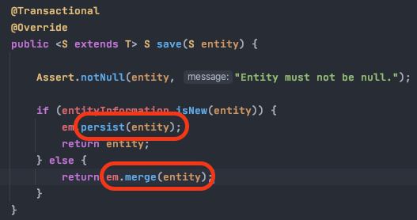
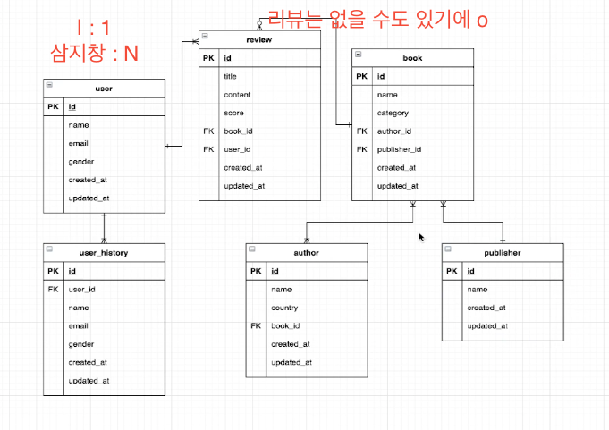

# JPA

## 각종 메소드 (crud)
### save
> 
> isNew를 통해 객체가 없으면 (isNew => getId 가 null 이면 true 리턴)
> persist(인서트)를하고 
> 객체가 있으면 merge(update를 실행한다.)


## 기본 사용법
> findAll(Sort)
```java
// 이름의 역순으로 리스트를 뽑아온다.
List<User> users = userRepository.findAll(Sort.by(Sort.Direction.DESC, "name"));
```


> findAllById(Lists)
```java
// id ==> 1, 3, 5의 리스트를 뽑아온다.
List<User> users = userRepository.findAllById(Lists.newArrayList(1L, 3L, 5L));
```


> saveAll(Lists)
```java
User user1 = User.builder()
                .name("짐승균")
                .email("짐승균@이메일.com")
                .build();
User user2 = User.builder()
        .name("짐승내")
        .email("짐승내@이메일.com")
        .build();

userRepository.saveAll(Lists.newArrayList(user1, user2));

List<User> users = userRepository.findAll();
users.forEach(System.out::println);
```

> existsById
```java
boolean exists = userRepository.existsById(1L);
System.out.println(exists); // true
```

> deleteAll(findAllById) --> 화면에서 복수선택 삭제 할 때 사용해도 되지 않을까? --> findAllById는 성능이슈가 있다. deleteInBatch를 사용하라.
```java
userRepository.deleteAll(userRepository.findAllById(Lists.newArrayList(1L, 3L, 5L)));
userRepository.findAll().forEach(System.out::println);
```

> deleteInBatch
```java
userRepository.deleteInBatch(userRepository.findAllById(Lists.newArrayList(1L, 3L, 5L)));
```

> deleteAllInBatch
```java
userRepository.deleteAllInBatch();
// delete from TABLE; 쿼리가 실행됨. select X --> 사용 할 일이 없을 듯 하다.
```

### deleteAll / deleteInBatch 차이점
* deleteAll 의 쿼리

##### select도, delete도 각각 처리한다. --> deleteAll에 userRepository.findAllById(Lists.newArrayList(1L, 3L, 5L)) 같은 파라미터를 줬을 경우 select도 각각 처리함. (삭제할 대상이 1천개이면 select을 1천번 하고 삭제도 1천번 하는 구조)

* deleteInBatch 의 쿼리

##### delete 시 OR 조건으로 지운다. (select 시 IN 조건으로 가져오는 것은 userRepository.findAllById(Lists.newArrayList(1L, 3L, 5L)) 이다.)

> page
``` java
        Page<User> users = userRepository.findAll(PageRequest.of(1, 3));
        System.out.println(">>> page: " + users);
        System.out.println(">>> total Elements: " + users.getTotalElements());
        System.out.println(">>> total Pages: " + users.getTotalPages());
        System.out.println(">>> number Of Elements: " + users.getNumberOfElements());
        System.out.println(">>> sort: " + users.getSort());
        System.out.println(">>> size: " + users.getSize());

        users.getContent().forEach(System.out::println);

// result
Hibernate: 
    select
        user0_.id as id1_0_,
        user0_.created_at as created_2_0_,
        user0_.email as email3_0_,
        user0_.name as name4_0_,
        user0_.updated_at as updated_5_0_ 
    from
        user user0_ limit ? offset ?
>>> page: Page 2 of 2 containing com.example.jpa.bookmanager.domain.User instances
>>> total Elements: 5
>>> total Pages: 2
>>> number Of Elements: 2
>>> sort: UNSORTED
>>> size: 3
User(id=4, name=beastnae, email=beastnae@nate.com, createdAt=2021-06-28T19:04:01.023, updatedAt=2021-06-28T19:04:01.023)
User(id=5, name=mxxnkyung, email=mxxnkyung@gmail.com, createdAt=2021-06-28T19:04:01.023, updatedAt=2021-06-28T19:04:01.023)
```

> like (ExampleMatcher)
```java
        ExampleMatcher matcher = ExampleMatcher.matching()
                .withIgnorePaths("name") // name은 무시한다.
                .withMatcher("email", endsWith()); // email은 확인하겠다.

        Example<User> example = Example.of(User.builder().name("mxxnkyung").email("@gmail.com").build(), matcher);

        userRepository.findAll(example).forEach(System.out::println);

// result
Hibernate: 
    select
        user0_.id as id1_0_,
        user0_.created_at as created_2_0_,
        user0_.email as email3_0_,
        user0_.name as name4_0_,
        user0_.updated_at as updated_5_0_ 
    from
        user user0_ 
    where
        user0_.email like ? escape ?
User(id=5, name=mxxnkyung, email=mxxnkyung@gmail.com, createdAt=2021-06-28T19:14:16.902, updatedAt=2021-06-28T19:14:16.902)
```

> ExampleMatcher(contains)
```java
        User user = User.builder().name("beast").build();
        ExampleMatcher matcher = ExampleMatcher.matching().withMatcher("name", contains());
        Example<User> example = Example.of(user, matcher);

        userRepository.findAll(example).forEach(System.out::println);

// result
Hibernate: 
    select
        user0_.id as id1_0_,
        user0_.created_at as created_2_0_,
        user0_.email as email3_0_,
        user0_.name as name4_0_,
        user0_.updated_at as updated_5_0_ 
    from
        user user0_ 
    where
        user0_.name like ? escape ?
User(id=3, name=beastkyun, email=beastkyun@nav.com, createdAt=2021-06-28T19:27:23.046, updatedAt=2021-06-28T19:27:23.046)
User(id=4, name=beastnae, email=beastnae@dau.com, createdAt=2021-06-28T19:27:23.046, updatedAt=2021-06-28T19:27:23.046)
```
* ExampleMatcher는 사용하다보면 뭔가 애매함을 느끼게 된다 한다. querydsl을 찾게 된다 함.

> update
```java
        userRepository.save(User.builder().name("충내르").email("충내@이메일.com").build());

        User user = userRepository.findById(1L).orElseThrow(RuntimeException::new);
        user.setEmail("noroguy@pornhub.com");

        userRepository.save(user);
// result
Hibernate: 
    select
        user0_.id as id1_0_0_,
        user0_.created_at as created_2_0_0_,
        user0_.email as email3_0_0_,
        user0_.name as name4_0_0_,
        user0_.updated_at as updated_5_0_0_ 
    from
        user user0_ 
    where
        user0_.id=?
Hibernate: 
    update
        user 
    set
        created_at=?,
        email=?,
        name=?,
        updated_at=? 
    where
        id=?

```

> flush
```java

```


## 쿼리 메소드 활용
> ### 객체로 찾는
```java
public interface UserRepository extends JpaRepository<User, Long> {
    User findByName(String name);
}
// 이 경우, 주 키가 아닌 name으로 찾고 있기 때문에 결과가 2개 이상일 경우 에러가 발생한다.
// 유저 단일 객체로 리턴을 해야한다.
query did not return a unique result: 2; nested exception is javax.persistence.NonUniqueResultException: query did not return a unique result: 2
```

> ### List로 찾는 
```java
public interface UserRepository extends JpaRepository<User, Long> {
    List<User> findByName(String name);
}
```

> ### 같은 결과를 도출 한다. (가독성 좋은 코드로 작성하자)
```java
        System.out.println(">>> findByEmail : " + userRepository.findByEmail("mxxnkyung@gmail.com"));
        System.out.println(">>> getByEmail : " + userRepository.getByEmail("mxxnkyung@gmail.com"));
        System.out.println(">>> readByEmail : " + userRepository.readByEmail("mxxnkyung@gmail.com"));
        System.out.println(">>> queryByEmail : " + userRepository.queryByEmail("mxxnkyung@gmail.com"));
        System.out.println(">>> searchByEmail : " + userRepository.searchByEmail("mxxnkyung@gmail.com"));
        System.out.println(">>> streamByEmail : " + userRepository.streamByEmail("mxxnkyung@gmail.com"));
        System.out.println(">>> findUserByEmail : " + userRepository.findUserByEmail("mxxnkyung@gmail.com"));
        System.out.println(">>> findSomethingByEmail : " + userRepository.findSomethingByEmail("mxxnkyung@gmail.com"));
```

> ### find Top/First 메소드 ( limit )
```sql
Hibernate: 
    select
        user0_.id as id1_0_,
        user0_.created_at as created_2_0_,
        user0_.email as email3_0_,
        user0_.name as name4_0_,
        user0_.updated_at as updated_5_0_ 
    from
        user user0_ 
    where
        user0_.name=? limit ?
-- where 절에 limit 조건이 추가된다.
```
> #### Last 같은 접두어는 인식하지 않는다.

> ### And 메소드
```java
List<User> findByEmailAndName(String email, String name);
```
```sql
Hibernate: 
    select
        user0_.id as id1_0_,
        user0_.created_at as created_2_0_,
        user0_.email as email3_0_,
        user0_.name as name4_0_,
        user0_.updated_at as updated_5_0_ 
    from
        user user0_ 
    where
        user0_.email=? 
        and user0_.name=?
```

> ### Or 메소드
```java
List<User> findByEmailOrName(String email, String name);
```
```sql
Hibernate: 
    select
        user0_.id as id1_0_,
        user0_.created_at as created_2_0_,
        user0_.email as email3_0_,
        user0_.name as name4_0_,
        user0_.updated_at as updated_5_0_ 
    from
        user user0_ 
    where
        user0_.email=? 
        or user0_.name=?
```
### 시간 비교하는 조건
#### After / Before (시간에 대한 조건)
```java
List<User> findByCreatedAtAfter(LocalDateTime yesterDay);

// UserRepositoryTest.java
System.out.println(">>> findByCreatedAtAfter : " + userRepository.findByCreatedAtAfter(LocalDateTime.now().minusDays(1L)));
```
```sql
Hibernate: 
    select
        user0_.id as id1_0_,
        user0_.created_at as created_2_0_,
        user0_.email as email3_0_,
        user0_.name as name4_0_,
        user0_.updated_at as updated_5_0_ 
    from
        user user0_ 
    where
        user0_.created_at > ?
```

#### GreaterThan (시간 비교시 After 와 같은 결과 도출)
```java
List<User> findByCreatedAtGreaterThan(LocalDateTime yesterday);
```
```sql
Hibernate: 
    select
        user0_.id as id1_0_,
        user0_.created_at as created_2_0_,
        user0_.email as email3_0_,
        user0_.name as name4_0_,
        user0_.updated_at as updated_5_0_ 
    from
        user user0_ 
    where
        user0_.created_at>?
```
#### GreaterThanEqual ( >= / <= ) *After와 Before는 Equal을 포함하지 않는다.
```java
List<User> findByCreatedAtGreaterThanEqual(LocalDateTime yesterday);
```
```sql
Hibernate: 
    select
        user0_.id as id1_0_,
        user0_.created_at as created_2_0_,
        user0_.email as email3_0_,
        user0_.name as name4_0_,
        user0_.updated_at as updated_5_0_ 
    from
        user user0_ 
    where
        user0_.created_at >= ?
```

#### Between
```java
List<User> findByCreatedAtBetween(LocalDateTime yesterday, LocalDateTime tomorrow);
List<User> findByIdBetween(Long id1, Long id2);
```
```sql
Hibernate: 
    select
        user0_.id as id1_0_,
        user0_.created_at as created_2_0_,
        user0_.email as email3_0_,
        user0_.name as name4_0_,
        user0_.updated_at as updated_5_0_ 
    from
        user user0_ 
    where
        user0_.created_at between ? and ?

Hibernate: 
    select
        user0_.id as id1_0_,
        user0_.created_at as created_2_0_,
        user0_.email as email3_0_,
        user0_.name as name4_0_,
        user0_.updated_at as updated_5_0_ 
    from
        user user0_ 
    where
        user0_.id between ? and ?
```

#### find By Id Greater Than Equal And Id Less Than Equal
```java
List<User> findByIdGreaterThanEqualAndIdLessThanEqual(Long id1, Long id2);
```
```sql
Hibernate: 
    select
        user0_.id as id1_0_,
        user0_.created_at as created_2_0_,
        user0_.email as email3_0_,
        user0_.name as name4_0_,
        user0_.updated_at as updated_5_0_ 
    from
        user user0_ 
    where
        user0_.id>=? 
        and user0_.id<=?
```

### null
> #### is not null
```java
List<User> findByIdIsNotNull();
```
```sql
Hibernate: 
    select
        user0_.id as id1_0_,
        user0_.created_at as created_2_0_,
        user0_.email as email3_0_,
        user0_.name as name4_0_,
        user0_.updated_at as updated_5_0_ 
    from
        user user0_ 
    where
        user0_.id is not null
```
> #### is not empty
```java
List<User> findByIdIsNotEmpty();
```
```s
error
IsEmpty / IsNotEmpty can only be used on collection properties!
IsEmpty / IsNotEmpty 는 컬렉션 프로퍼티에서만 사용할 수 있다.
```
```java
    @OneToMany(fetch = FetchType.EAGER)
    private List<Address> address;
    
    List<User> findByAddressIsNotEmpty();
```
```sql
Hibernate: 
    select
        user0_.id as id1_1_,
        user0_.created_at as created_2_1_,
        user0_.email as email3_1_,
        user0_.name as name4_1_,
        user0_.updated_at as updated_5_1_ 
    from
        user user0_ 
    where
        exists (
            select
                address2_.id 
            from
                user_address address1_,
                address address2_ 
            where
                user0_.id=address1_.user_id 
                and address1_.address_id=address2_.id
        )
>>> findByAddressIsNotEmpty : []
```

> ### In
```java
    List<User> findByNameIn(List<String> names);
    // Iterator타입인 List가 들어가고 find할 타입이 제네릭에 들어간다. (여기선 Name)
    System.out.println(">>> findByNameIn : " + userRepository.findByNameIn(Lists.newArrayList("mxxnkyung", "norotoo")));
```
```sql
Hibernate: 
    select
        user0_.id as id1_1_,
        user0_.created_at as created_2_1_,
        user0_.email as email3_1_,
        user0_.name as name4_1_,
        user0_.updated_at as updated_5_1_ 
    from
        user user0_ 
    where
        user0_.name in (
            ? , ?
        )
```

> ### Starting With / Ending With / contains ( like 검색 제공, 문자열에 대한 쿼리로 동작)
```java
    List<User> findByNameStartingWith(String name); // 앞 => searchKeyword%
    List<User> findByNameEndingWith(String name); // 뒤 => %searchKeyword
    List<User> findByNameContains(String name); // 중간 => %searchKeyword%%

    List<User> findByNameLike(String name); // 매개변수에 %%를 사용한다. 가독성을 해침

        System.out.println(">>> findByStartingWith : " + userRepository.findByNameStartingWith("beast"));
        System.out.println(">>> findByEndingWith : " + userRepository.findByNameEndingWith("yun"));
        System.out.println(">>> findByContains : " + userRepository.findByNameContains("xx"));

        System.out.println(">>> findByNameLike : " + userRepository.findByNameLike("%xx%") );
```

> ### Is
```
Is는
Is, Equals (or no keyWord) 면 Is와 동일하게 본다.
    ex) 이 친구들은 같은 친구들이다.
        Set<User> findUserByNameIs(String name);
        Set<User> findUserByName(String name);
        Set<User> findUserByNameEquals(String name);
```

### Sort
> #### Order by .. 
```java
List<User> findTopByNameOrderByIdDesc(String name);
List<User> findFirstByNameOrderByIdDescEmailAsc(String name);
```
```sql
Hibernate: 
    select
        user0_.id as id1_1_,
        user0_.created_at as created_2_1_,
        user0_.email as email3_1_,
        user0_.name as name4_1_,
        user0_.updated_at as updated_5_1_ 
    from
        user user0_ 
    where
        user0_.name=? 
    order by
        user0_.id desc limit ?

Hibernate: 
    select
        user0_.id as id1_1_,
        user0_.created_at as created_2_1_,
        user0_.email as email3_1_,
        user0_.name as name4_1_,
        user0_.updated_at as updated_5_1_ 
    from
        user user0_ 
    where
        user0_.name=? 
    order by
        user0_.id desc,
        user0_.email asc limit ?
```
> #### PagingAndSortingRepository Sort
```java
List<User> findFirstByName(String name, Sort sort);
    System.out.println(">>> findFirstByNameWithSortParams : " + userRepository.findFirstByName("mxxnkyung", Sort.by(Sort.Order.desc("id"))));

Sort.by는 Order를 arr로 받을 수 있다.
userRepository.findFirstByName("mxxnkyung", Sort.by(Sort.Order.desc("id"), Sort.Order.asc("email")));
    따라서 이렇게도 사용이 가능하다.

// result
// List<User> findTopByNameOrderByIdDesc(String name); 와 같은 쿼리 도출
```

### Pageable
```java
Page<User> findByName(String name, Pageable pageable);
    System.out.println(">>> findByNameWithPaging page 1p : " + userRepository.findByName("mxxnkyung", PageRequest.of(0, 1, Sort.by(Sort.Order.desc("id")))).getContent());
    System.out.println(">>> findByNameWithPaging page 2p : " + userRepository.findByName("mxxnkyung", PageRequest.of(1, 1, Sort.by(Sort.Order.desc("id")))).getContent());
```
```sql
Hibernate: 
    select
        user0_.id as id1_1_,
        user0_.created_at as created_2_1_,
        user0_.email as email3_1_,
        user0_.name as name4_1_,
        user0_.updated_at as updated_5_1_ 
    from
        user user0_ 
    where
        user0_.name=? 
    order by
        user0_.id desc limit ?
Hibernate: 
    select
        address0_.user_id as user_id1_2_0_,
        address0_.address_id as address_2_2_0_,
        address1_.id as id1_0_1_ 
    from
        user_address address0_ 
    inner join
        address address1_ 
            on address0_.address_id=address1_.id 
    where
        address0_.user_id=?
Hibernate: 
    select
        count(user0_.id) as col_0_0_ 
    from
        user user0_ 
    where
        user0_.name=?
>>> findByNameWithPaging page 1p : [User(id=6, name=mxxnkyung, email=mxxnkyung@naver.com, createdAt=2021-07-01T18:17:04.475, updatedAt=2021-07-01T18:17:04.475, address=[])]
Hibernate: 
    select
        user0_.id as id1_1_,
        user0_.created_at as created_2_1_,
        user0_.email as email3_1_,
        user0_.name as name4_1_,
        user0_.updated_at as updated_5_1_ 
    from
        user user0_ 
    where
        user0_.name=? 
    order by
        user0_.id desc limit ? offset ?
Hibernate: 
    select
        address0_.user_id as user_id1_2_0_,
        address0_.address_id as address_2_2_0_,
        address1_.id as id1_0_1_ 
    from
        user_address address0_ 
    inner join
        address address1_ 
            on address0_.address_id=address1_.id 
    where
        address0_.user_id=?
Hibernate: 
    select
        count(user0_.id) as col_0_0_ 
    from
        user user0_ 
    where
        user0_.name=?
>>> findByNameWithPaging page 2p : [User(id=5, name=mxxnkyung, email=mxxnkyung@gmail.com, createdAt=2021-07-01T18:17:04.475, updatedAt=2021-07-01T18:17:04.475, address=[])]
```

## @Enitity (Entity 객체)
```
    엔티티 객체는 PK(@Id)를 지정해야한다.
```
> ### @GenerationValue
```java
public enum GenerationType { 
    TABLE,      // DB 종류에 상관 없이 Id값을 관리하는 별도의 테이블을 만들어두고 그 테이블에서 Id값을 추출하여 사용
    SEQUENCE,   // Oracle, PostgreSql 등에서 사용하게 됨.
    IDENTITY,   // 일반적으로 MySql(MariaDB)에서 많이 사용하는 전략. 특징: 이가 빠진것 처럼 특정 값이 비는 현상이 있다.
    AUTO        // Default, 각 DB에 적합한 값을 자동으로 넘겨줌.
}
```

### @Table
```
속성
name
indexes (@Index)
uniqueConstraints (@UniqueConstraint)
```

### @Column
```
속성
name
nullable
unique
length
insertable // false => 인서트시 제외
updatable // false => 업데이트시 제외
```

### @Transient
```
db에 반영하지 않고 그냥 사용하고 싶은, 테스트 데이터 성격의. 객체에서 따로 쓸 데이터.

영속성 처리에서 제외가 되고, Db에 반영 되지 않으며
해당 객체와 생명주기를 같이하는 값이 된다.
```

### @Enumerated
```
속성
value = EnumType.STRING / ORDINAL 등
ORDINAL을 사용하면 잠재적 버그가 발생 한다.
```

## Entity Listener ( like SQL Trigger )
> Entity Listener는 SpringBean을 주입 받지 못 한다.
> 
> ex) 
> ```java
> @Component
> public class UserEntityListener {
>     @Autowired
>     private UserHistoryRepository userHistoryRepository;
>  // 주입 못 받음 null pointer exception
> ``` 

```java
어노테이션
    @PrePersist     // insert 호출 되기 전에
    @PreUpdate      // merge가 호출 되기 전에
    @PreRemove      // delete가 호출 되기 전

    @PostPersist    // insert 호출 된 후에
    @PostUpdate     // merge가 호출 된 후에
    @PostRemove     // delete가 호출 된 후에
    @PostLoad       // select가 호출 된 후에.
```


## 연관관계
> 

### 1:1 연관관계
### 1:N 연관관계
### N:1 연관관계
### N:N 연관관계