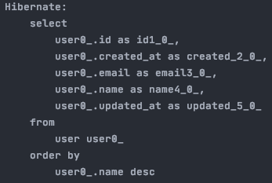
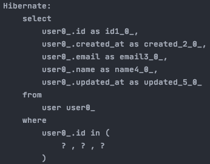
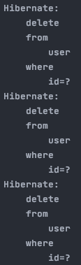
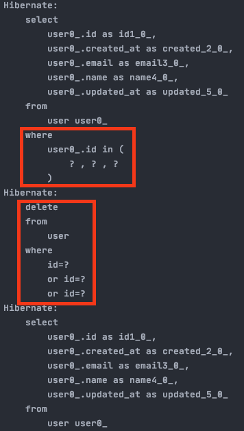

# JPA
> findAll(Sort)
```java
// 이름의 역순으로 리스트를 뽑아온다.
List<User> users = userRepository.findAll(Sort.by(Sort.Direction.DESC, "name"));
```


> findAllById(Lists)
```java
// id ==> 1, 3, 5의 리스트를 뽑아온다.
List<User> users = userRepository.findAllById(Lists.newArrayList(1L, 3L, 5L));
```


> saveAll(Lists)
```java
User user1 = User.builder()
                .name("짐승균")
                .email("짐승균@이메일.com")
                .build();
User user2 = User.builder()
        .name("짐승내")
        .email("짐승내@이메일.com")
        .build();

userRepository.saveAll(Lists.newArrayList(user1, user2));

List<User> users = userRepository.findAll();
users.forEach(System.out::println);
```

> existsById
```java
boolean exists = userRepository.existsById(1L);
System.out.println(exists); // true
```

> deleteAll(findAllById) --> 화면에서 복수선택 삭제 할 때 사용해도 되지 않을까? --> findAllById는 성능이슈가 있다. deleteInBatch를 사용하라.
```java
userRepository.deleteAll(userRepository.findAllById(Lists.newArrayList(1L, 3L, 5L)));
userRepository.findAll().forEach(System.out::println);
```

> deleteInBatch
```java
userRepository.deleteInBatch(userRepository.findAllById(Lists.newArrayList(1L, 3L, 5L)));
```

> deleteAllInBatch
```java
userRepository.deleteAllInBatch();
// delete from TABLE; 쿼리가 실행됨. select X --> 사용 할 일이 없을 듯 하다.
```

### deleteAll / deleteInBatch 차이점
* deleteAll 의 쿼리

##### select도, delete도 각각 처리한다. --> deleteAll에 userRepository.findAllById(Lists.newArrayList(1L, 3L, 5L)) 같은 파라미터를 줬을 경우 select도 각각 처리함. (삭제할 대상이 1천개이면 select을 1천번 하고 삭제도 1천번 하는 구조)

* deleteInBatch 의 쿼리

##### delete 시 OR 조건으로 지운다. (select 시 IN 조건으로 가져오는 것은 userRepository.findAllById(Lists.newArrayList(1L, 3L, 5L)) 이다.)

> page
``` java
        Page<User> users = userRepository.findAll(PageRequest.of(1, 3));
        System.out.println(">>> page: " + users);
        System.out.println(">>> total Elements: " + users.getTotalElements());
        System.out.println(">>> total Pages: " + users.getTotalPages());
        System.out.println(">>> number Of Elements: " + users.getNumberOfElements());
        System.out.println(">>> sort: " + users.getSort());
        System.out.println(">>> size: " + users.getSize());

        users.getContent().forEach(System.out::println);

// result
Hibernate: 
    select
        user0_.id as id1_0_,
        user0_.created_at as created_2_0_,
        user0_.email as email3_0_,
        user0_.name as name4_0_,
        user0_.updated_at as updated_5_0_ 
    from
        user user0_ limit ? offset ?
>>> page: Page 2 of 2 containing com.example.jpa.bookmanager.domain.User instances
>>> total Elements: 5
>>> total Pages: 2
>>> number Of Elements: 2
>>> sort: UNSORTED
>>> size: 3
User(id=4, name=beastnae, email=beastnae@nate.com, createdAt=2021-06-28T19:04:01.023, updatedAt=2021-06-28T19:04:01.023)
User(id=5, name=mxxnkyung, email=mxxnkyung@gmail.com, createdAt=2021-06-28T19:04:01.023, updatedAt=2021-06-28T19:04:01.023)
```

> like (ExampleMatcher)
```java
        ExampleMatcher matcher = ExampleMatcher.matching()
                .withIgnorePaths("name") // name은 무시한다.
                .withMatcher("email", endsWith()); // email은 확인하겠다.

        Example<User> example = Example.of(User.builder().name("mxxnkyung").email("@gmail.com").build(), matcher);

        userRepository.findAll(example).forEach(System.out::println);

// result
Hibernate: 
    select
        user0_.id as id1_0_,
        user0_.created_at as created_2_0_,
        user0_.email as email3_0_,
        user0_.name as name4_0_,
        user0_.updated_at as updated_5_0_ 
    from
        user user0_ 
    where
        user0_.email like ? escape ?
User(id=5, name=mxxnkyung, email=mxxnkyung@gmail.com, createdAt=2021-06-28T19:14:16.902, updatedAt=2021-06-28T19:14:16.902)
```

> ExampleMatcher(contains)
```java
        User user = User.builder().name("beast").build();
        ExampleMatcher matcher = ExampleMatcher.matching().withMatcher("name", contains());
        Example<User> example = Example.of(user, matcher);

        userRepository.findAll(example).forEach(System.out::println);

// result
Hibernate: 
    select
        user0_.id as id1_0_,
        user0_.created_at as created_2_0_,
        user0_.email as email3_0_,
        user0_.name as name4_0_,
        user0_.updated_at as updated_5_0_ 
    from
        user user0_ 
    where
        user0_.name like ? escape ?
User(id=3, name=beastkyun, email=beastkyun@nav.com, createdAt=2021-06-28T19:27:23.046, updatedAt=2021-06-28T19:27:23.046)
User(id=4, name=beastnae, email=beastnae@dau.com, createdAt=2021-06-28T19:27:23.046, updatedAt=2021-06-28T19:27:23.046)
```
* ExampleMatcher는 사용하다보면 뭔가 애매함을 느끼게 된다 한다. querydsl을 찾게 된다 함.


> flush
```java

```


