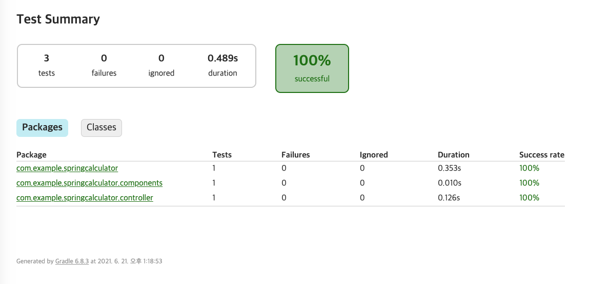

## TDD
    테스트 주도 개발에서 사용하지만, 
    코드의 유지 보수 및 운영 환경에서의 에러를 미리 방지하기 위해서
    단위 별로 검증하는 테스트 프레임워크

### 단위 테스트
    작성 코드가 기대하는 대로 동작을 하는지 검증하는 절차


### JUNIT
    JAVA 기반의 단위 테스트를 위한 프레임 워크
        Annotation 기반으로 테스트를 지원하며 Assert를 통하여 ( 예상, 실제 )를 통해 검증


### Jacoco
    Java코드의 코드 커버리지를 체크 하는 라이브러리.
    결과를 html, xml, csv로 확인 가능함.

> build.gradle
```
plugins
    id 'jacoco' 추가
```
> gradle tasks -> verification -> test  (jacocoTestReport)
> build/reports/tests/test/index.html

> 
> 테스트 결과 html 파일로 확인

### 인텔리제이
    > 새 프로젝트
        > gradle
            > 자바 11
                > build.gradle에 test 관련 디펜던시 추가 및 test { useJUnitPlatform 추가 }
                    > mockito 추가
                        > maver repository
                            > mockito 검색 후 mockito Core / Mockito jUnit Jupiter
                                >  gradle 디펜던시 복사후 build.gralde 붙여넣기
            > Mocking 처리
                > 
    