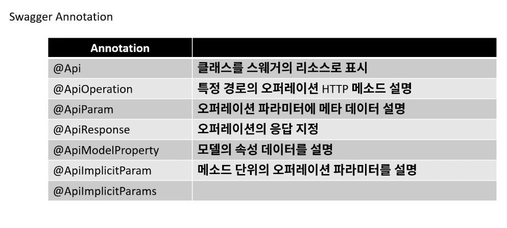

## NPM 과 NPX 의 차이
    npm이 프로그램을 설치하는 것이라면
    npx는 프로그램을 임시로 설치하여 한번만 실행시키고 지우는 것
    ****은 아닌듯 다시 정리 필요

## 컴퓨터에서 자료를 표현하는 방법
    이진수
        > 비트(bit) : 컴퓨터에서 자료를 표현하는 최소 단위 0 또는 1
        > 바이트(byte) : 8bit
        > 이진수 : 컴퓨터에서 표현되는 자료의 형태
                0000 1010 (이진수) => 10 (십진수)
        > 8진수 : 이진수를 3비트씩 모아서 표현
        > 16진수 : 이진수를 4비트씩 모아서 표현

## 컴퓨터에서 음수 표현하기
    > 2의 보수로 표현 
    > 양수와 음수는 더해서 0이 되어야 함
        ex) 0000 0101 (5)
            1111 1010 (1의 보수)
            1111 1011 (5에 대한 2의 보수)
    > 2의 보수 만드는 방법 (음수 만드는 방법) : 1의 보수를 취하고 나서 1을 더해 줌


## 소켓 통신
    접속을 계속 유지하여, 데이터를 전달.
    서버의 자원에 따라서 연결 될 수 있는 클라이언트의 숫자가 한정된다.
    실시간 정보 교호나에 사용하며 HTTP보다 속도가 빠르다.
## HTTP 통신
    클라이언트의 요청이 있을 때만 데이터 응답을 전달.
    불필요한 자원의 점유를 없애 다른 접속을 원활하게 하여 많은 데이터를 처리.
    데이터 요청 후 응답이 오면 연결은 끊어진다.


## REST API
> https://meetup.toast.com/posts/92

### HTTP - GET 메소드
    주소 창에 파라미터 노출.
    브라우저에서 주소에 대한 캐시가 이루어지므로, 정보를 얻을 때 사용.
### HTTP - POST 메소드
    주소 창에 파라미터 노출 X.
    주소 창에 사용자의 요청 사항이 노출 되지 않는다.
    Get 방식에서는 주소 길이 제한이 있지만 Post는 그보다 길게 사용 가능(제한 존재)
    브라우저가 주소 캐시를 하지 못 하는 특성이 있다.
### HTTP - PUT / PATCH 메소드
    POST와 마찬가지로 BODY에 데이터가 들어 있으며, 주로 업데이트에 사용
### HTTP - DELETE 메소드
    GET과 마찬가지로 주소에 파라미터가 들어가며, 데이터를 삭제 할 때 사용

## REST의 개념
    HTTP 프로토콜에 있는 Method를 활용한 아키텍처 스타일.
    HTTP 메소드를 통해서 Resource를 처리한다.
    CRUD를 통한 Resource를 조작할 때 사용.
        메소드      /        동작          / URL 형태
        GET           조회 SELECT * FROM    /user/{id}
        POST          생성 CREATE           /user
        PUT / PATCH   수정 UPDATE / CREATE  /user
        DELETE        삭제 DELETE           /user/{id}

## 도메인
```DOMAIN

```
### Multi-tier Architecture
    3-tier Architecture
        > Presentation -> 사용자와 소통하는 부분    (Front-end)
        Business -> 사용자와 소통한 결과          (Back-end)
            > Layered Architecture
                1. UI Layer
                    2. Application Layer
                    3. Domain Layer
                    4. Infrastructure Layer
        Data Source -> 처리한것들이 저장 되는 곳  (DB)

### 디자인 패턴
```
자주 사용 하는 설계 패턴을 정형화 해서 이를 유형별로 가장 최적의 방법으로 개발을 할 수 있도록 정해둔 설계
알고리즘과 유사하지만, 명확하게 정답이 있는 형태는 아니며, 프로젝트의 상황에 맞추어 적용 가능.
    Gof 디자인 패턴
        소프트웨어를 설계할 때는 기존의 경험이 매우 중요하다. 그러나 모든 사람들의 다양한 경험을 가지고 있을 수는 없다.
        이러한 지식을 공유하기 위해서 나온 것이 GOF(Gang of Four)의 디자인 패턴이다.
        객체지향 개념에 따른 설계 중 재사용할 경우 유용한 설계를 디자인 패턴으로 정리해둔 것이다.
        Gof 디자인 패턴은 총 23개이며, 이를 잘 이해하고 활용한다면, 경험이 부족하더라도 좋은 소프트웨어 설계가 가능하다.
```
> 장점
1. 개발자(설계자) 간의 원활한 소통
2. 소프트웨어 구조 파악 용이
3. 재사용을 통한 개발 시간 단축
4. 설계 변경 요청에 대한 유연한 대처
> 단점
1. 객체지향 설계 / 구현
2. 초기 투자 비용 부담

> 생성 패턴
> 
    객체를 생성하는 것과 관련된 패턴으로, 객체의 생성과 변경이 전체 시스템에 미치는 영향을 최소화 하고, 코드의 유연성을 높여 준다.
        > Factory Method
        > Singleton *
        > Prototype
        > Builder
        > Abstract Factory
        > Chaining
> 구조 패턴
> 
    프로그램 내의 자료구조나 인터페이스 구조 등 프로그램 구조를 설계하는데 활용 될 수 있는 패턴
    클래스, 객체들의 구성을 통해서 더 큰 구조를 만들 수 있게 해줌.
    큰 규모의 시스템에서는 많은 클래스들이 서로 의존성을 가지게 되는데, 이런 복잡한 구조를 개발하기 쉽게 만들어 주고, 유지보수 하기 쉽게 만들어 줌.
        > Adapter *
        > Composite
        > Bridge
        > Decorator *
        > Facade *
        > Flyweight
        > Proxy *
> 행위 패턴
> 
    반복적으로 사용되는 객체들의 상호작용을 패턴화한 것으로, 클래스나 객체들이 상호작용하는 방법과 책임을
    분산하는 방법 제공.
    행위 패턴은 행위 관련 패턴을 사용하여 독립적으로 일을 처리하고자 할 때 사용.
        > Template Method
        > Interpreter
        > Iterator
        > Observer *
        > Strategy *
        > Visitor
        > Chain of responsibility
        > Command
        > Mediator
        > Starter라는> Memento
    
> Singleton 패턴
> 
    어떠한 클래스(객체)가 유일하게 1개만 존재 할 때 사용.
    이를 주로 사용하는 곳은 서로 자원을 공유 할 때 사용하는데, 현실에서는 프린터가 해당되며,
    실제 프로그래밍에서는 TCP Socket 통신에서 서버와 연결된 connect 객체에 주로 사용.
> Adapter 패턴
> 
    현실에서 100V를 220V로 변경해주거나, 그 반대로 해주는, 흔히 돼지코라 불리는 변환기를 예로 들 수 있다.
    호환성이 없는 기존 클래스의 인터페이스를 변환하여 재사용 할 수 있도록 한다.
    SOLID에서 개방폐쇄 원칙(OCP)을 따른다.
> Proxy 패턴
> 
    대리인이라는 뜻으로써, 뭔가를 대신해서 처리하는 것
    Proxy Class를 통해서 대신 전달하는 형태로 설계되며, 실제 Client는 Proxy로 부터 결과를 받는다.
    Cache의 기능으로도 활용이 가능하다.
    SOLID중에서 개방폐쇄원칙(OCP)과 의존역전원칙(DIP)를 따른다.
> Observer 패턴
> 
    관찰자 패턴은 변화가 일어 났을 때, 미리 등록 된 다른 클래스에 통보해주는 패턴을 구현 한 것.
    많이 보이는 곳은 event listener에서 해당 패턴을 사용 하고 있다.
> Facade 패턴
> 
    건물의 앞쪽 정면이라는 뜻을 가진다. 여러개의 객체와 실제 사용하는 서브 객체의 사이에 복잡한 의존관계가 있을 때,
    중간에 facade라는 객체를 두고, 여기서 제공하는 interface만을 활용하여 기능을 사용 하는 방식.
    Facade는 자신이 가지고 있는 각 클래스의 기능을 명확히 알아야 한다.
> Strategy pattern
> 
    전략 패턴으로 불리며, 객체지향의 꽃.
    유사한 행위들을 캡슐화하여, 객체의 행위를 바꾸ㅡ고 싶은 경우 직접 변경하는 것이 아닌 전략만 변경하여,
    유연하게 확장하는 패턴 SOLID중에서 개방폐쇄원칙(OCP)과 의존역전원칙(DIP)를 따른다.
        전략 메서드를 가진 전략 객체 (Normal Strategy, Base64 Strategy)
        전략 객체를 사용 하는 컨텍스트 (Encoder)
        전략 객체를 생성해 컨텍스트에 주입 하는 클라이언트 (Main)

### URI 설계 패턴
    URI (Uniform Resource Identifier)
        인터넷에서 특정 자원을 나타내는 주소 값. 해당 값은 유일하다. (응답은 달라 질 수 있다.)
        요청 : https://www.google.co.kr/resource/sample/1
        응답 : google.pdf / google.docx
    URL (Uniform Resource Locator)
        인터넷 상에서의 자원, 특정 파일이 어디에 위치하는지 식별하는 주소.
        요청 : https://www.google.co.kr/google.pdf
            URL은 URI의 하위 개념이다.
    URI 설계 원칙 ( RFC-3986에 정의 되어 있음.)
        > 슬래시 구분자(/)는 계층 관계를 나타내는데 사용 한다.
        > URI 마지막 문자로 (/)는 포함하지 않는다.
        > 하이픈(-)은 URI 가독성을 높이는데 사용한다.
        > 언더바(_)는 사용하지 않는다.
        > URI 경로에는 소문자가 적합핟.
        > 파일 확장자는 URI에 포함하지 않는다.
        > 프로그래밍 언어에 의존적인 확장자를 사용하지 않는다.
        > 구현에 의존적인 경로를 사용하지 않는다.
        > 세션ID를 포함하지 않는다.
        > 프로그래밍 언어의 메소드명을 이용하지 않는다.
        > 명사에 단수형 보다는 복수형을 사용해야 한다. 컬렉션에 대한 표현은 복수로 사용
        > 컨트롤러 이름으로는 동사나 동사구를 사용 한다.
        > 경로 부분 중 변하는 부분은 유일한 값으로 대체한다.
        > CRUD 기능을 나타내는 것은 URI에 사용하지 않는다.
        > URI Query Parameter 디자인
        > URI 쿼리는 컬렉션의 결과를 페이지로 구분하여 나타내는데 사용 한다.

## HTTP Protocol
    HTTP는 메시지를 주고 (Request) 받는 (Response) 형태의 통신 방법이다.
        HTTP 요청 메소드
            1. GET          리소스 취득
            2. POST         리소스 생성, 추가
            3. PUT          리소스 갱신, 생성
            4. DELETE       리소스 삭제
            5. HEAD         헤더 데이터 취득
            6. OPTIONS      지원하는 메소드 취득
            7. TRACE        요청메시지 반환
            8. CONNECT      프록시 동작의 터널 접속으로 변경
        Http Status Code
            1XX 처리중              처리가 계속 되고 있는 상태.
            2XX 성공                요청의 성공.
            3XX 리다이렉트          다른 리소스로 리다이렉트. 해당 코드를 받았을 때는 Response의 새로운 주소로 다시 요청
            4XX 클라이언트 에러     클라이언트의 요청에 에러가 있는 상태. 재전송해도 에러가 해결 되지 않음.
            5XX 서버에러            서버 처리중 에러가 발생한 상태. 재 전송시 에러가 해결 되었을 수도.
            > 자주 보는 코드
                200     성공
                201     성공. 리소스를 생성 성공
                301     리다이렉트, 리소스가 다른 장소로 변경 됨을 알림
                303     리다이렉트, Client에서 자동으로 새로운 리소스로 요청 처리
                400     요청 오류, 파라미터 에러
                401     권한 없음 (인증실패)
                404     리소스 없음 (페이지를 찾을 수 없음)
                500     서버 내부 에러 (서버 동작 처리 에러)
                503     서비스 정지 (점검 등등)

## Swagger
```
개발한 REST API를 편하게 문서화 해주고, 이를 통해서 관리 및 제 3의 사용자가 편리하게
API를 호출해보고 테스트 할 수 있는 프로젝트.

Spring Boot에서는 간단하게 springfox-boot-starter를 gradle dependencies에 추가함으로 사용 할 수 있다.

운영환경과 같은 곳에서는 동작하지 않게 주의해야 한다.

서버 실행 후 
http://localhost:8080/swagger-ui/
swagger-ui/ (슬래시를 붙여야 함.)
```
> 


## 웹 서비스 확장 전략
    실무 개발 유형
    솔루션 개발 / SI 개발 / 서비스 개발(고가용성)
        솔루션 개발 EX) DB 접근 제어, 암호화 등 B2B(회사대회사)
        서비스 개발 EX) B2C(회사대고객)
        SI 개발     EX) 고객사 시스템 중에서 특정 부분에 대하여 개선 등으로 교체 