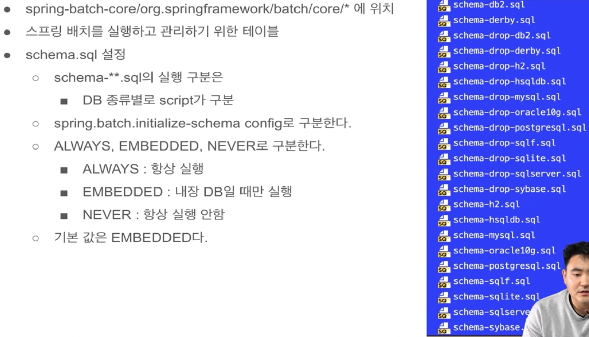

# Spring Batch
```
    큰 단위의 작업을 일괄 처리
    
    대부분 처리량이 많고 비 실시간성 처리에 사용
        대용량 데이터 계산, 정산, 통계, 데이터베이스, 변환 등
    
    컴퓨터 자원을 최대로 활용
        컴퓨터 자원 사용이 낮은 시간대에 배치를 처리하거나
        배치만 처리하기 위해 사용자가 사용하지 않는 또 다른 컴퓨터 자원을 사용
    
    사용자 상호작용으로 실행되기 보단, 스케줄러와 같은 시스템에 의해 실행되는 대상
        예를 들면 매일 오전 10시에 배치 실행, 매주 월요일 12시 마다 실행
        crontab, jenkins ...
    
    배치 처리를 하기 위한 Spring Framework 기반 기술
        Spring에서 지원하는 기술 적용 가능
        DI, AOP, 서비스 추상화
```
## 스프링 배치의 실행 단위인 Job과 Step
> 비교적 간단한 작업(Tasklet) 단위 처리와, 대량 묶음(Chunk) 단위 처리

### @EnableBatchProcessing
> 이 애플리케이션은 배치프로세싱을 하겠다. 어노테이션
    
### Job
```
JobBuilderFactory.class
    스프링 배치에서 Job은 배치의 실행 단위
    실행 단위를 구분할 수 있는 incrementer (RunIdIncrementer -> 잡이 실행할때마다 파라미터 아이디를 자동으로 생성해주는 클래스)
```    
### Step
```
StepBuilderFactory.class
    스프링 배치에서 Step은 Job의 실행 단위, 하나의 Job은 한 개 이상의 Step을 가질 수 있다.
    Step도 Job처럼 Bean으로 만든다.
    Job과 Step은 스프링 배치에서 거의 모든 것.
```

### 어떤 Job을 실행할지 설정
```
Edit Configurations
        Environment
                Program arguments -> --spring.batch.job.names=helloJob
    이렇게 설정 하면 helloJob 이라는 Job만 이 애플리케이션을 시작할 때 실행하겠다.
    
    모든 배치가 실행 되는 것을 막기 위해
    application.yml
        spring:
            batch:
                job:
                names: ${job.name:NONE}
    키 설정 값을 job.name으로 커스텀하면 job.name으로 실행 할 수 있고, 설정값이 없어도 아무런 배치가 실행 되지 않는다.
```

## Spring Batch의 구조
> 
```
    Spring Batch는 Job Type의 Bean이 생성 되면 JobLauncher 객체에 의해서 Job을 실행하고, Job은 Step을 실행한다.
    
    JobRepository는 디비 또는 메모리에 스프링 배치가 실행할 수 있도록 배치의 메타 데이터를 관리하는 클래스이다.

        Job은 JobLauncher에 의해 실행
        Job은 배치의 실행 단위를 의미
        Job은 N개의 Step을 실행 할 수 있으며, 흐름(Flow)을 관리할 수 있다.
            예를 들면, A Step 실행 후 조건에 따라 B Step 또는 C Step을 실행 설정
    
    Step은 Job의 세부 실행 단위이며, N개가 등록 돼 실행 된다.
    Step의 실행 단위는 크게 2가지로 나눌 수 있다.
        1. Chunk 기반: 하나의 큰 덩어리를 n개씩 나눠서 실행
        2. Task 기반: 하나의 작업 기반으로 실행
    Chunk 기반 Step은 ItemReader, ItemProcessor, ItemWriter가 있다.
        여기서 Item은 배치 처리 대상 객체를 의미한다.
    ItemReader는 배치 처리 대상 객체를 읽어 ItemProcessor 또는 ItemWriter에게 전달한다.
        예를 들면, 파일 또는 DB에서 데이터를 읽는다.
    ItemProcessor는 input 객체를 output 객체로 filtering 또는 processing 해 ItemWriter에게 전달한다.
        예를 들면, ItemReader에서 읽은 데이터를 수정 또는 ItemWriter 대상인지 filtering 한다.
        ItemProcessor는 optional 하다.
        ItemProcessor가 하는 일을 ItemReader 또는 ItemWriter가 대신할 수 있다.
    ItemWriter는 배치 처리 대상 객체를 처리한다.
        예를 들면, DB update를 하거나, 처리 대상 사용자에게 알림을 보낸다.
```

## Spring 배치에서 메타데이터를 관리하는 테이블의 구조
```
    배치 실행을 위한 메타데이터가 저장되는 테이블
    BATCH_JOB_INSTANCE
        Job이 실행 되며 생성 되는 최상위 계층의 테이블
        job_name과 job_key를 기준으로 하나의 row가 생성되며, 같은 job_name과 job_key가 저장 될 수 없다.
        job_key는 BATCH_JOB_EXECUTION_PARAMS에 저장되는 Parameter를 나열해 암호화 해 저장한다.
    BATCH_JOB_EXECUTION
        Job이 실행되는 동안 시작/종료 시간, job 상태 등을 관리
    BATCH_JOB_EXECUTION_PARAMS
        Job을 실행하기 위해 주입 된 parameter 정보 저장
    BATCH_JOB_EXECUTION_CONTEXT
        Job이 실행되며 공유해야할 데이터를 직렬화 해 저장
    BATCH_STEP_EXECUTION
        Step이 실행되는 동안 필요한 데이터 또는 실행 된 결과 저장
    BATCH_STEP_EXECUTION_CONTEXT
        Step이 실행되며 공유해야 할 데이터를 직렬화 해 저장
```

## 메타테이블의 스크립트는 스프링배치코어 프로젝트 패키지 밑에 존재
> 

### 스크립트 생성 시점 설정
```yml
    spring:
        batch:
          initialize-schema: always     테이블을 항상 실행 할 수 있는 (개발)
                             embedded   h2 디비 같은 내장 디비를 사용할때만 생성 할 수 있는 (개발)
                             never      절대 실행하지 않는 (운영)
    
    운영환경에서 스프링 배치에 의해 스크립트가 자동으로 생성 된다는 의미는
    SQL DDL이 운영 DB에 직접 실행 된다는 것이다. 단거ㅋ
```

## 메타테이블이 어떻게 객체와 매핑되고 사용 되는지
```
    JobInstance: BATCH_JOB_INSTANCE 테이블과 매핑
    JobExecution: BATCH_JOB_EXECUTION 테이블과 매핑
    JobParameters: BATCH_JOB_EXECUTION_PARAMS 테이블과 매핑
    ExecutionContext: BATCH_JOB_EXECUTION_CONTEXT 테이블과 매핑

    JobInstance의 생성 기준은 JobParameters 중복 여부에 따라 생성
    다른 parameter로 Job이 실행 되면, JobInstance가 생성
    같은 parameter로 Job이 실행 되면, 이미 생성 된 JobInstance가 실행
    JobExecution은 항상 새롭게 생성
    예를 들어
        처음 Job 실행 시 date parameter가 1월 1일로 실행 됐다면, 1번 JobInstance 생성
        다음 Job 실행 시 date parameter가 1월 2일로 실행 됐다면, 2번 JobInstance 생성
        다음 Job 실행 시 date parameter가 1월 2일로 실행 됐다면, 2번 JobInstance 재실행
            이때 Job이 재실행 대상이 아닌 경우 에러가 발생
    Job을 항상 새로운 JobInstance가 실행 될 수 있도록 RunIdIncrementer 제공
        RunIdIncrementer는 항상 다른 run.id를 parameter로 설정

    StepExecution: BATCH_STEP_EXECUTION 테이블과 매핑
    ExecutionContext: BATCH_STEP_EXECUTION_CONTEXT 테이블과 매핑

    JobInstance는 Job 이름과 Parameter 의 값을 기준으로 생성 되느냐, 재실행이냐, 재실행에 실패하냐. 결정
        하나의 Job은 같은 Parameter로 새롭게 실행할 수 없다. 

    ExecutionContext라는 객체는 Job과 Step의 Context를 관리하는 객체.
        이 객체를 통해 데이터를 서로 공유할 수 있다.
```

# part 3

## Task 기반 배치와 Chunk 기반 배치
```
    배치를 처리 할 수 있는 방법은 크게 2가지
        Tasklet을 사용한 Task 기반 처리
            - 배치 처리 과정이 비교적 쉬운 경우 쉽게 사용
            - 대량 처리를 하는 경우 더 복잡
            - 하나의 큰 덩어리를 여러 덩어리로 나누어 처리하기 부적합
        Chunk를 사용한 chunk(덩어리) 기반 처리
            - ItemReader, ItemProcessor, ItemWriter의 관계 이해 필요
            - 대량 처리를 하는 경우 Tasklet 보다 비교적 쉽게 구현
            - 예를 들면 10,000개의 데이터 중 1,000개씩 10개의 덩어리로 수행
                이를 Tasklet으로 처리하면 10,000개를 한번에 처리하거나, 수동으로 1,000개씩 분할
```
### chunkBaseStep
> 
> 
> chunk기반의 step 종료 시점은 itemReader에서 null을 return할 때 까지(처리할 데이터가 없다는 뜻) Step이 반복된다.

## JobParameters의 이해
```
    - 배치 실행에 필요한 값을 parameter를 통해 외부에서 주입
    - JobParameters는 외부에서 주입 된 parameter를 관리하는 객체
    - parameter를 JobParametes와 Spring EL(Expression Language)로 접근
        - String parameter = jobParameters.getString(key, defaultValue);
        - @Value("#{jobParmeters[key]}") // *lobmok Value가 아닌 spring Value
    
Edit Configurations
        Environment
                Program arguments -> `-chunkSize=20` --job.name=chunkProcessingJob
```

### JobScope와 StepScope의 이해
```
    - @Scope는 어떤 시점에 bean을 생성/소멸 시킬 지 bean의 lifecycle을 설정
        스프링에서 스코프는 빈의 라이프사이클을 설정할 수 있는 기술
        스프링에서 기본스코프는 싱글톤 스코프다.
            싱글톤 스코프의 생성과 소멸 주기는, 애플리케이션이 실행되는 시점에 생성, 종료되는 시점에 소멸
            
    - @JobScope는 job 실행 시점에 생성/소멸
        - Step에 선언

    - @StepScope는 step 실행 시점에 생성/소멸
        - Tasklet, Chunk(ItemReader, ItemProcessor, ItemWriter) 에 선언

    - Spring의 @Scope과 같은 것
        - @Scope("job") == @JobScope
        - @Scope("step") == @StepScope

    - Job과 Step 라이프 사이클에 의해 생성되기 때문에 Thread safe하게 작동

    - @Value("#{jobParameters[key]}")를 사용하기 위해 @JobScope와 @StepScope는 필수
```

## ItemReader interface 구조
```
    - 배치 대상 데이터를 읽기 위한 설정
        - 파일, DB, 네트워크 등에서 읽기 위함.
    
    - Step에 ItemReader는 필수
    
    - 기본 제공되는 ItemReader 구현체
        - file, jdbc, jpa, hibernate, kafka, etc...

    - ItemReader 구현체가 없으면 직접 개발

    - ItemStream은 ExecutionContext로 read, write 정보를 저장

    - CustomItemReader 예제.. [part3 패키지]
        > CustomItemReader
        > ItemReaderConfiguration
        > Template 작성 (save as template 검색)
```
> 

### CSV 파일 데이터 읽기 (FlatFileItemReader)
```
    FlatFileItemReader 클래스로 파일에 저장 된 데이터를 읽어 객체에 매핑

    예제 참고 [part3 패키지]
        > ItemReaderConfiguration
```

### JDBC 데이터 읽기
```
    - Cursor 기반 조회
        배치 처리가 완료될 때 까지 DB Connection이 연결
        DB Connection 빈도가 낮아 성능이 좋은 반면, 긴 Connection 유지 시간 필요
        하나의 Connection에서 처리되기 때문에, Thread Safe 하지 않음
        모든 결과를 메모리에 할당하기 때문에, 더 많은 메모리를 사용

    - Paging 기반 조회
        페이징 단위로 DB Connection을 연결
        DB Connection 빈도가 높아 비교적 성능이 낮은 반면, 짧은 Connection 유지 시간 필요
        매번 Connection을 하기 때문에 Thread Safe
        페이징 단위의 결과만 메모리에 할당하기 때문에 비교적 더 적은 메모리를 사용
```
> 

### JPA 데이터 읽기
```
    - 4.3+ 에서 Jpa 기반 Cursor ItemReader가 제공 됨.
    - 기존에는 Jpa는 Paging 기반의 ItemReader만 제공 됨.
```
> 

## ItemWriter interface 구조 이해
```
    - ItemWriter는 마지막으로 배치 처리 대상 데이터를 어떻게 처리할 지 결정
    - Step에서 ItemWriter는 필수
    - 예를 들면 ItemReader에서 읽은 데이터를 DB에 저장, API로 서버에 요청, 파일에 데이터를 write
    - 항상 write가 아님
        데이터를 최종 마무리 하는 것이 ItemWriter
```
> 

### CSV 파일 데이터 쓰기
```
    - FlatFileItemWriter는 데이터가 매핑 된 객체를 파일로 write
    
    예제 참고 (part 3 ItemWriterConfiguration csvFileWriter)
```

### JDBC 데이터 쓰기
```yml
spring:
  datasource:
    hikari:
      jdbc-url: jdbc:mysql://127.0.0.1:3306/batch_study?characterEncoding=UTF-8&serverTimezone=UTC&`rewriteBatchedStatements=true` -- mysql 벌크 인서트 옵션을 사용하기 위한.
      driver-class-name: com.mysql.cj.jdbc.Driver
      username: root
      password: Qpalzm!2
  jpa:
    hibernate:
      ddl-auto: `update` -- person 테이블이 없는경우엔 생성하고, person entity가 변경 된 경우에는 업데이트한다
batch:
  initialize-schema: never
```
```
    - JdbcBatchItemWriter는 jdbc를 사용해 DB에 write
    - JdbcBatchItemWriter는 bulk insert/update/delete처리
        insert into person (name, age, address) values (1,2,3), (4,5,6), (7,8,9);
    - 단건 처리가 아니기 떄문에 비교적 높은 성능

    예제 참고 (part 3 ItemWriterConfiguration jdbcBatchItemWriterStep)
```

### JPA 데이터 쓰기
```
    - JpaItemWriter는 JPA Entity 기반으로 데이터를 DB에 write
    - Entity를 하나씩 EntityManger.persist 또는 EntityManager.merge로 insert
        .usePersist(true) 

    예제 참고 (part 3 ItemWriterConfiguration jpaBatchItemWriterStep)
```

## ItemProcessor interface 구조 이해, 과제 요구 사항 설명
```
    - ItemReader에서 읽은 데이터를 가공 또는 Filtering
    - Step의 ItemProcessor는 optional
    - ItemProcessor는 필수는 아니지만, 책임 분리를 분리하기 위해 사용
    - ItemProcessor는 Input을 Output으로 변환하거나 ItemWriter의 실행 여부를 판단 할 수 있도록 filtering 역할을 한다.
        ItemWriter는 not null만 처리 한다.
    - 예를 들어 person.id가 짝수인 person만 return 하는 경우
    - ItemWriter는 5개의 person만 받아 처리
    
    예제 참고 (part 3 ItemProcessorConfiguration itemProcessorStep)
```
> 

## CSV 파일 데이터 읽고 MySql DB에 insert 하기
```
    - CSV 파일 데이터를 읽어 H2 DB에 데이터 저장하는 배치 개발
    - Reader
        100개의 person data를 csv 파일에서 읽는다.
    - Processor
        1. allow_duplicate 파라미터로 person.name의 중복 여부 조건을 판단한다.
        2. `allow_duplicate=true`인 경우 모든 person을 return 한다.
        3. `allow_duplicate=false 또는 null`인 경우 person.name이 중복 된 데이터는 null로 return 한다.
        4. 힌트: 중복 체크는 `java.util.Map` 사용
    - Writer
        1. 2개의 ItemWriter를 사용해서 Person H2 DB에 저장 후 몇 건 저장 됐는 지 log를 찍는다.
        2. Person 저장 ItemWriter와 log 출력 ItemWriter
        3. 힌트: `CompositeItemWriter` 사용
```

## 테스트 코드 작성하기
```
    - JobLauncher는 Job을 실행
    - JobLauncherTestUtils는 테스트 코드에서 Job과 Step 실행
    
    예제참고 (part 3 test/SavePersonConfigurationTest)
```


# part 4