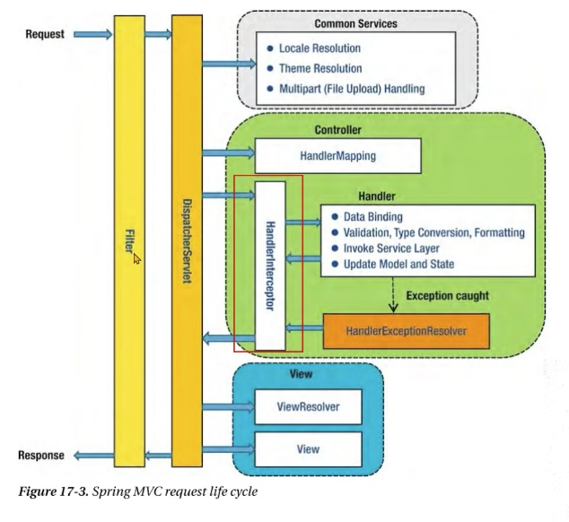
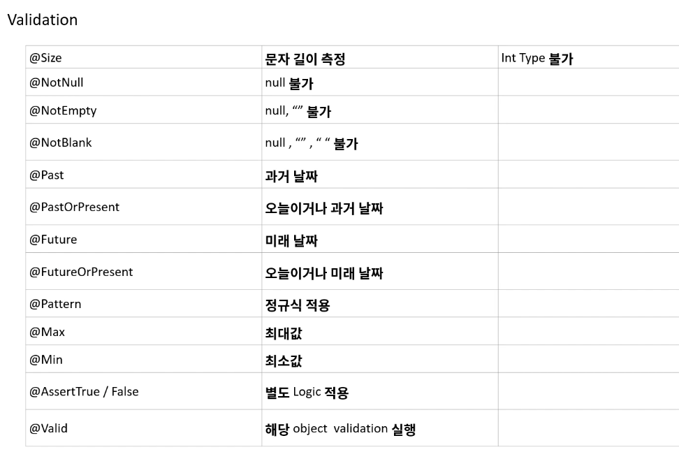
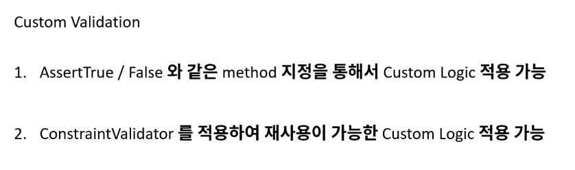
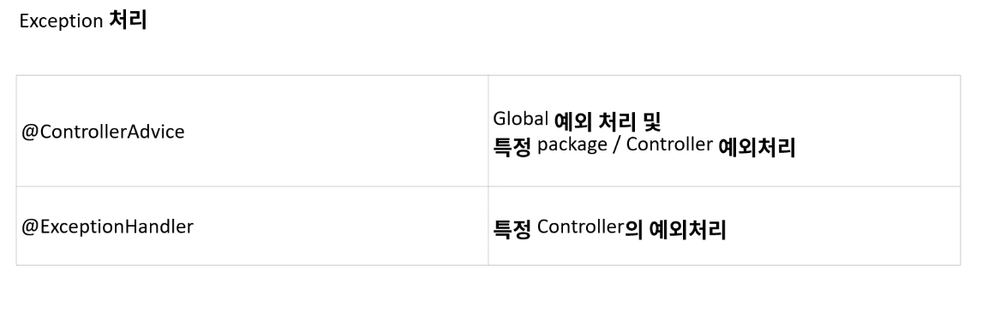

# Spring 관련 공부

# Spring MVC request life cycle
> 

# Spring Boot
    // SpringFramework의 설정이 너무 복잡하고 어려웠기 때문에, 이를 해결하기 위해 만들어짐.
    // SpringBoot가 나오면서 초기 생산성이 획기적으로 좋아짐.

    // 스프링은 다양한 식재료이고, 스프링부트는 완성 된 케이크.

    // 스프링부트는 Starter라는 라이브러리를 통한 어플리케이션의 간편하고 자동화 된 빌드 및 설정을 제공.
    // Embed 된 was서버를 제공함으로써 복잡한 배포 설정들을 간편하게 제공.
    // Production에서 사용할 수 있는 추가적인 기능 제공(actuator)

    // CoC (Convention Over Configuration)

    // 스프링 부트에서는 잭슨라이브러리를 기본적으로 내장
    // 따로 설정하지 않는다면 객체를 리턴할 땐 자동적으로 제이슨으로 변환되어 리턴된다.

    // 주소가 겹치면 스프링부트는 실행되지 않는다. (메소드 단위)
    // 컨트롤러 단위로는 실행된다.

    // 단순히 실행되며, 프로덕션 제품 수준으 ㅣ스프링 기반 어플리케이션을 쉽게 만들 수 있다.
    // Spring 구성이 거의 필요하지 않다.
    // java -jar로 실행하는 JAVA 어플리케이션을 만들 수 있다.
----------
----------
## *application.properties (main/resource/)
    스프링 부트 프로젝트에 추가 된 라이브러리들의 설정들을 관리하는 곳
        ex) spring.datasource.url=jdbc:mysql://localhost:3306/study?useSSL=false&useUnicode=true&serverTimezone=Asia/Seoul
            spring.datasource.username=
            spring.datasource.password=
----------
----------
## DI의 기본 핵심은 싱글톤,
    ...
----------
----------
## IoC / DI (의존 관계 주입) 
    IoC (Inversion Of Control) 제어의 역전
        스프링에서는 일반적인 Java 객체를 new로 생성하여 개발자가 관리하는 것이 아닌 Spring Container에 모두 맡긴다.
        즉, 개발자에서 -> 프레임워크로 제어의 객체 관리의 권한이 넘어 갔음으로 "제어의 역전"이라고 한다.
    DI (Dependency Injection)
        장점
            > 의존성으로부터 격리시켜 코드 테스트에 용이하다.
            > DI를 통하여, 불가능한 상황을 Mock와 같은 기술을 통하여 안정적으로 테스트가 가능하다.
            > 코드를 확장하거나 변경 할 때 영향을 최소화 한다 (추상화)
            > 순환참조를 막을 수 있다.
        
----------
----------
## AOP (관점 중심 프로그램)
    관점지향 프로그램
    스프링 어플리케이션은 대부분 특별한 경우를 제외하고, MVC 웹 어플리케이션 많이 사용.
    Web Layer, Business Layer, Data Layer로 정의.
        - Web Layer : REST API를 제공하며, Client 중심의 로직 적용
        - Business Layer : 내부 정책에 따른 logic을 개발하며, 주로 해당 부분을 개발
        - Data Layer : 데이터 베이스 및 외부와의 연동을 처리
    dependency 추가해야함
    implementation 'org.springframework.boot:spring-boot-starter-aop'

    주요 Annotation
        @Aspect
            > 자바에서 널리 사용하는 AOP 프레임워크에 포함되며, AOP를 정의하는 Class에 할당
        @Pointcut
            > 기능을 어디에 적용시킬지, 메소드? Annotation?등 AOP를 적용 시킬 지점을 설정
        @Before
            > 메소드 실행하기 이전
        @After
            > 메소드가 성공적으로 실행 후, 예외가 발생 되더라도 실행
        @AfterReturing
            > 메소드 호출 성공 실행시 (Not Throws)
        @AfterThrowing
            > 메소드 호출 실패 예외 발생 (Throws)
        @Around
            > Before / After 모두 제어
    로그용으로 사용 할만 한 듯하다. 용도는 이게 다인가 ?
----------
----------
## PSA (이식 가능한 추상화)
----------
----------

## Validation
    프로그래밍에 있어서 가장 필요한 부분.
    특히 자바에서는 null 값에 대해서 접근 하려 할 때 null pointer exception이 발생 함으로, 이러한 부분을 방지하기 위해서 미리 검증하는 과정
> 단순하게 아래와 같은 코드들
```java
public void run(String acc, String pw) {
    if(acc == null || pw == null){
        return
    }
    // 정상 Logic
}
```
1. 검증해야 할 값이 많은 경우 코드의 길이가 길어진다.
2. 구현에 따라서 달라 질 수 있지만 Service Logic과의 분리가 필요하다.
3. 흩어져 있는 경우 어디에서 검증을 하는지 알기 어려우며, 재사용의 한계가 있다.
4. 구현에 따라 달라 질 수 있지만, 검증 Logic이 변경되는 경우 테스트 코드 등
    참조하는 클래스에서 Logic이 변경되어야 하는 부분이 발생 할 수 있다.
> 참고용 https://beanvalidation.org/2.0-jsr380/

> 관련 annotation
> 

> build.gradle 디펜던시 추가
```
implementation 'org.springframework.boot:spring-boot-starter-validation'
```
```java
@Valid @RequestBody User user
validation이 필요한곳엔 @Valid 어노테이션을 추가한다.
```
> 휴대폰 번호 정규식 및 정규식 어노테이션
```java
"^\\d{2,3}-\\d{3,4}-\\d{4}$"

 @Pattern(regexp = "^\\d{2,3}-\\d{3,4}-\\d{4}$")
    private String phoneNumber;
```
> 모든 Validation 어노테이션에는 message 속성을 가지고 있다.
```java
@NotBlank
private String name;

@Max(value = 100)
private int age;

@Email(message = "이메일 양식이 올바르지 않습니다.")
private String email;

@Pattern(regexp = "^\\d{2,3}-\\d{3,4}-\\d{4}$", message = "핸드폰 번호의 양식과 맞지 않습니다. 01x-xxx(x)-xxxx")
private String phoneNumber;

public String getName() {
    return name;
}
```
> Custom Validation


----------
----------
## Exception 처리
> Web Application의 입장에서 바라 보았을 때, 에러가 났을 때 내려줄 수 있는 방법은 많지 않다.
1. 에러 페이지
2. 4XX Error or 5XX Error
3. Client가 200 외에 처리를 하지 못 할 때는 200 을 내려주고 별도의 에러 Message 전달


> #### [내꺼 참고용 링크](https://github.com/kimmoonkyung/spring-exception)

----------
----------

## Filter-Interceptor
```
Filter란 Web Application에서 관리되는 영역으로, Spring Boot Framework에서 Client로 부터 오는 요청/응답에 대해서 최초/최종 단계의 위치에 존재하며, 이를 통해서 요청/응답의 정보를 변경하거나, Spring에 의해서 데이터가 변환되기 전의 순수한 Client의 요청/응답 값을 확인 할 수 있다.

유일하게 ServletRequest, ServletResponse의 객체를 변환 할 수 있다.

주로 Spring Framewokr에서는 request / response의 Logging 용도로 활용하거나,
인증과 관련된 Logic 들을 해당 Filter에서 처리한다.

이를 선/후 처리 함으로써, Service business logic과 분리 시킨다.

Interceptor 란 Filter와 매우 유사한 형태로 존재하지만, 차이점은 Spring Context에 등록 된다.
AOP와 유사한 기능을 제공 할 수 있으며,

주로 인증 단계를 처리 하거나, Logging을 하는데에 사용 한다.

이를 선/후 처리 함으로써, Service business logic과 분리 시킨다.
```
----------
----------

## Server to Server
> git url
> https://github.com/kimmoonkyung/server-to-server_client
> https://github.com/kimmoonkyung/server-to-server_server

> Rest Template
```java
getForObject
    RestTemplate restTemplate = new RestTemplate();
    // String result = restTemplate.getForObject(uri, String.class);
    // getForObject => server의 return값 그대로, "hello server" 문자열이 return 된다.
getForEntity [ResponseEntity 를 사용한다.]
    ResponseEntity<String> result = restTemplate.getForEntity(uri, String.class);
    log.info("result.getStatusCode: {}", result.getStatusCode()); // 200 OK
    log.info("result.getBody: {}", result.getBody());   // hello server 
```

## Spring batch
```
```

## Spring Cloud
```
```

----------
----------
### 기타
    포트 변경 - application.properties 
        > server.port=9090    
    터미널에서 ./gradlew bootRun 으로 서버 실행

----------
----------
## JPA
    ORM ( Object Relational Mapping )으로, RDB 데이터베이스의 정보를 객체지향으로 손쉽게
        활용 할 수 있도록 도와 주는 도구.
    Object(자바객체)와 Relation(관계형 데이터베이스) 둘 간의 맵핑을 통해서 보다
        손쉽게 적용 할 수 있는 기술을 제공.
    또한 쿼리에 집중하기 보다는 객체에 집중 함으로써 조금 더 프로그래밍 적으로 많이 활용 할 수 있다.
----------
----------
### Entity
    JPA에서는 테이블을 자동으로 생성해주는 기능 존재.
    DB TABLE === JPA ENTITY
```
연관 관계 설정
    관계     /   Annotation
    일대일   /   @OneToOne
    일대다   /   @OneToMany
    다대일   /   @ManyToOne
    다대다   /   @ManyToMany
    Long이 아니라 객체로 연결한다.
```
```
FetchType (LAZY = 지연로딩 , EAGER = 즉시로딩)
    // LAZY = select * from ITEM where id = ?
    // 변수에 대해서 겟 메소드를 호출 하지 않는 이상 연관 관계가 설정 된 테이블에 대해서 셀렉하지 않겠다.
    // EAGER = JOIN >> item.id = orderDetail.id
    // 즉시 모든 것을 다 로딩 하겠다, 연관 관계가 설정 된 모든 테이블에 대해 조인이 일어난다.
    // 1 : 1(@OneToOne)이나 @ManyToOne에 대해서 한건만 존재할 때 사용
```
```java
    @OneToOne(cascade = {CascadeType.PERSIST, CascadeType.MERGE, CascadeType.REMOVE})
        cascade 폭포수? 영속성을 함께 관리하겠다 라는 의미.
        CascadeType.ALL -> 전체를 다 적용
        ex) 예제 spring-boot-study-2

        orpharRemoval = true
        fetch = FetchType.EAGER
        optional = false

    @OneToMany(fetch = FetchType.LAZY, mappedBy = "item")
        1대N 관계는 페치타입을 걸어준다.
        1대N 이기 때문에 리스트 타입으로 받아온다.

    @ManyToOne
        객체를 생성하되, 대상(One)의 mappedBy와 일치해야 한다.
            ex) OneEntity.java
                @OneToMany(fetch = FetchType.LAZY, mappedBy = "one")
                ManyEntity.java
                private List<Many> manyList;
                @ManyToOne
                private One one;
```
----------
----------

# TDD (Test Driven Development)
> JUNIT_MEMO.md
```
...
```
    
----------
----------
## @Annotation
> Lombok

```
// 롬복은 플러그인도 설치해야 한다.
// 설치 후 활성화 까지. (컴파일러 - Annotation Processor)
@Data
    자동으로 기본 생성자와, 게터세터 등 다양한 메소드 (재정의도) 생성해준다.
    인텔리제이에서 Structure 탭을 보면 @Data 어노테이션 추가시의 마법을 볼 수 있음.

@Table
    실제 DB테이블의 이름을 명시 (테이블명과 엔티티명이 동일하면 선언하지 않아도 됨.)
@Entity
    해당 클래스가 Entity임을 명시
    Jpadml Entity 및 column을 자동으로 camelCase로 DB의 snake_case에 매핑 해준다.
    @Id
        Index primary key를 명시
    @GeneratedValue
        Primary key 식별키의 전략 설정
    @Column
        실제 DB Column의 이름을 명시

@NoArgsConstructor
    기본 생성자를 생성해주는 어노테이션
@AllArgsConstructor
    모든 아규먼트를 가지는 변수에 대해서 생성자를 추가
    생성자 자동 생성 어노테이션!
@RequiredArgsConstructor
    @NonNull과 함께 사용한다.
        > 그러나 Builder가 있는 이상 무쓸모로 느껴진다.

@ToString
    @Data로 생성된 투스트링을 제외한다.
    ex) @ToString(exclude = {"필드1", "필드2"})
@Builder
```
```
@Accessors(chain = true)
    > 체이닝하여 객체를 셋 할 수 있음
        ex) User user =  new User().setAccount("아이디").setEmail("이메일");
```
```
@Repository
    따로 쿼리문을 작성하지 않아도 기본적인 CRUD 내장
    @Repository interface UserRepository extends JpaRepository<User, Long>{}
        > 제네릭으로 연결할 엔티티와, 키의 타입을 선언한다.
```
```
@EnableJpaAuditing
    Jpa 감시자 활성
@EntityListeners(AuditingEntityListener.class)
    Jpa Entity에 이벤트가 발생할 때 콜백을 처리하고 코드를 실행 하는
```
```
@JsonProperty
    제이슨 형태를 만들 때 사용
    api 작성시 snake_case를 많이 사용한다. (전문을 주고 받을때)
        ex) @JsonProperty("snake_case")
        스프링부트는 application.properties 파일에
            spring.jackson.property-naming-strategy=SNAKE_CASE
            를 해주면 간단하다.
@JsonInclude(JsonInclude.Include.NON_NULL)
@JsonNaming(value = PropertyNamingStrategy.SnakeCaseStrategy.class)
```
```
@PageableDefault(sort = "id", direction = Sort.Direction.ASC, page = 15) Pageable pageable
    sort > id를 가지고 order by
    direction > asc 로 정렬 한다
    size > 데이터를 15개씩 표시
```
```
@Configuration

``` 
```
@RestController
    @GetMapping
    @PostMapping
    @PatchMapping
    @DeleteMapping
```
```
@CrossOrigin
...
```

```
@PostConstruct(admni service 공부 하면서 추상화 관련 작업할 때 씀)
...
```

----------
----------

# todo-server
    gradle 설정 (build.gradle)
        plugin
            id 'org.springframework.boot' version '2.4.2'
            id 'io.spring.dependency-management' version('1.0.11.RELEASE')
            id 'java'
        dependencies
            implementation('org.springframework.boot:spring-boot-starter-data-rest')
            implementation('org.springframework.boot:spring-boot-starter-data-jpa')
            runtimeOnly('com.h2database:h2')
            annotationProcessor('org.projectlombok:lombok')
            compileOnly('org.projectlombok:lombok')
            // 롬복은 플러그인도 설치해야 한다.
            // 설치 후 활성화 까지. (컴파일러 - Annotation Processor)
            testImplementation('org.springframework.boot:spring-boot-starter-test')
        test
            useJUnitPlatform()
----------
    Entity(model) 생성
        @Data
        @Entity
        @NoArgsConstructor
        @AllArgsConstructor
            @Column
----------
    Repository 생성
        @Repository
        public interface TodoRepository extends JpaRepository<TodoEntity, Long> {
            // JpaRepository 를 상속 하고 제네릭으로
            // 앞은 데이터베이스 테이블과 연결 될 객체인 엔티티,
            // 뒤는 해당 객체의 id의 해당하는 필드 타입을 넣어준다.
        }
----------
    Service 생성
        @Service
        @AllArgsConstructor
        public class TodoService {
            private final TodoRepository todoRepository;
----------
    Controller 생성
        @Slf4j // log.info("STRING")
        @CrossOrigin
        @AllArgsConstructor
        @RestController
        @RequestMapping("/")
        public class TodoController {
            private final TodoService todoService;
----------
----------
    TodoServerApplication
        @SpringBootApplication
        public class TodoServerApplication {
            public static void main(String[] args) {
                System.out.println("NICE 9OOD");
                SpringApplication.run(TodoServerApplication.class, args);
            }
        }
----------
----------
    Test 코드 작성
    // Mock 사용 이유
    // 외부 시스템에 의존하지 않고 자체 테스트를 실행 할 수 있어야 하기 때문.
    // 유닛 테스트는 네트워크나 DB가 연결 되지 않는다 하여 테스트가 실행이 불가하면 안 되기 때문에.
    // 또 실제 DB를 사용하게 되면 테스트 내용이 그대로 반영 되기 때문.
        TodoService [ Opt + Enter ] > 테스트 생성
            import static org.mockito.Mockito.when;
            import static org.mockito.ArgumentMatchers.any;

            @ExtendWith(MockitoExtension.class)
            class TodoServiceTest
                @Mock
                private TodoRepository todoRepository;

                @InjectMocks
                private TodoService todoService;
        
        TodoController
            @WebMvcTest(TodoController.class)
            class TodoControllerTest {

                @Autowired
                MockMvc mvc;

                @MockBean
                TodoService todoService;

                private TodoEntity expected;
----------
----------

# admin 페이지 만들기
    gradle 설정 (build.gradle)
        dependencies
            compile('org.springframework.boot:spring-boot-starter-data-jpa')
            compile('mysql:mysql-connector-java')
            compile 'org.projectlombok:lombok:1.18.10'
            annotationProcessor 'org.projectlombok:lombok:1.18.10'
    
    CRUD API 로직
        C > Request 데이터(body)를 받아와서
            body로 엔티티를 빌드해주고.
            빌드 해준 엔티티를 뉴 엔티티로 repository에 세이브 시킨다.
            세이브 해준 뉴엔티티는 response로 배출
        R > id를 받아와서
            repository에서 findById 해주고
            .map(있으면 response 리턴 한다. 무엇을? OK를 )
            .orElesGet(없으면 response에 Error를 리턴한다.)
        U > request 데이터(body)를 받아와서
            body에 있는 id로 찾되,
            .map(엔티티가 있으면 body의 데이터로 set 시켜주고 셋 시킨 엔티티를 리턴시킨다)
            .map(리턴 된 엔티티를 repository에 세이브 시킨다.)
            .수정이 정상적으로 실행 되었으면 엔티티를 리스폰스 해준다.
            .없으면 에러를 리스폰스 한다.
        D > id를 받아와서
            repository에서 id로 찾아주고
            .있으면 delete 시키고 Ok를 리턴한다.
            .없으면 에러 리턴

    Pageable(org.springframework.data.domain.Pageable)
        log pageable -> Page request [number: 0, size 20, sort: UNSORTED]
            ?page=3 -> Page request [number: 3, size 20, sort: UNSORTED]

    OrderInfo 로직
        1. id를 통해 유저 객체를 가져오고
        1-1. 유저 객체로 UserApiResponse를 만들어 놓는다.
        
        2. 유저의 객체를 가지고 OrderGroup를 담는 orderGroupList를 가져온다.
        
        3. List로 된 OrderGroupApiResponse를 만드는데,
        
        3-1. 가져온 orderGroupList를 stream을 통해 map으로 찾아서
        3-2. OrderGroupApiResponse를 orderGroupApiLogicService를 이용하여 OrderGroupApiResponse 데이터를 가져온다.

        4. List로 된 ItemApiResponse를 만드는데,
        4-1. orderGroupList의 orderDetailList를 .stream(). map으로 찾는다.
        4-2. map에서 orderDetail 데이터를 찾으면 그 데이터의 아이템을 가져오고(getItem)
        4-3. 그 아이템을 다시 map으로 돌려서 itemApiLogicService를 이용해 ItemApiResponse 데이터를 가져온다.
        4-4. 만들어낸 ItemApiResponse를 Collectors를 이용해 List로 변환 ( collect(Collectors.toList()) )

        5. 만들어 진 ItemApiResponse(List)를 OrderGroupApiResponse의 itemApiResponseList에 set 시킨다.
        5-1. 5번을 리턴시킨다.

        6. 3 ~ 5번 까지의 과정으로 만들어진 객체를 다시 List에 담는다. (**OrderGroupApiResponseList**).collect(Collectors.toList())

        7. 6번에서 만든 OrderGroupApiResponseList를 1번에서 만든 userApiResponse의 orderGroupApiResponseList에 SET 시킨다.
        
        8. 7번의 결과물을 UserOrderInfoApiResponse(유저 주문정보)의 userApiResponse에 담는다.
        
        9. Header를 통해 8번을 response 시킨다.
----------
----------
# bootstudy 3 레스토랑 예약 백엔드
        디렉토리를 하나 만들어서 ( ex: moonkyung-backend )
            백엔드 관련 소스 이동 ( src, build.gradle 등 )
        settings.gradle 에 include 설정
            include 'moonkyung-backend'
        
        build.gradle
            implementation 'org.springframework.boot:spring-boot-starter-data-jpa'
            runtimeOnly('com.h2database:h2') // jpa를 주입해놓고 datasource 설정을 하지 않으면 Failed to configure a DataSource: 'url' attribute is not specified and no embedded datasource could be configured. 에러 발생.
            implementation 'org.springframework.boot:spring-boot-starter-web'
            compileOnly 'org.projectlombok:lombok'
            developmentOnly 'org.springframework.boot:spring-boot-devtools'
            annotationProcessor 'org.projectlombok:lombok'
            testImplementation 'org.springframework.boot:spring-boot-starter-test'
        
        WebMvcTest
            @ExtendWith(MockitoExtension.class)
            @WebMvcTest
                @Autowired
                private Mockmvc mvc
